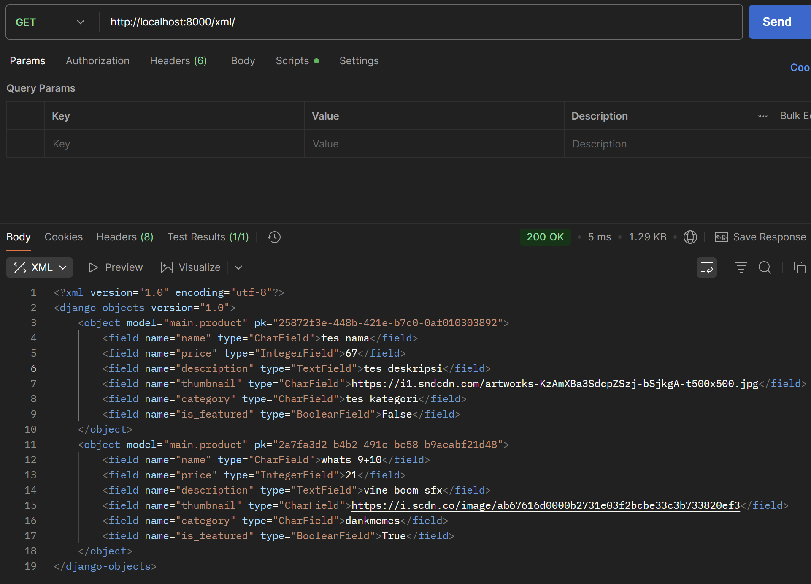
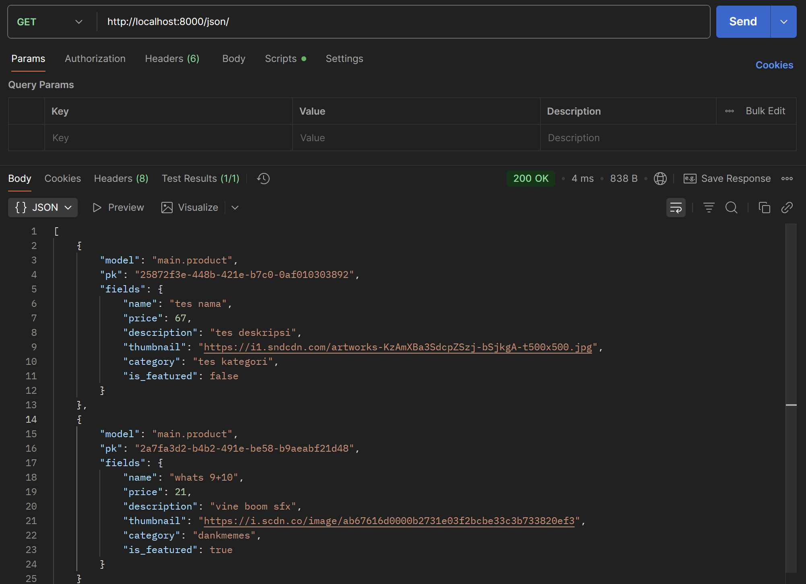
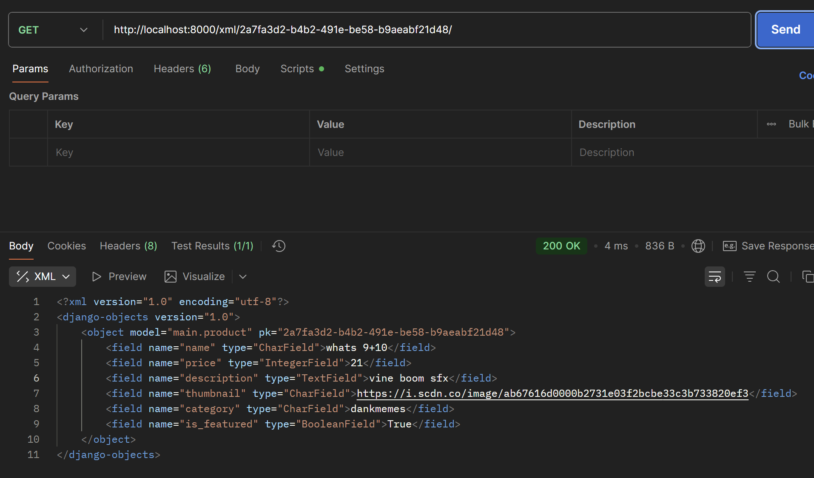
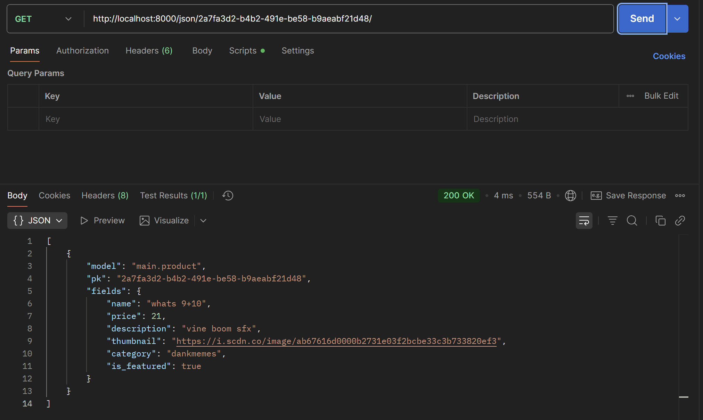

# sefruit shop
https://farrel-rifqi-footballshop.pbp.cs.ui.ac.id/

# Tugas 2
## Implementasi Checklist
### Membuat projek Django baru
1. Set up python environment
   ```bash
   python -m venv env
   env\Scripts\activate
2. Buat projek django dan aplikasi baru
   ```bash
   django-admin startproject football_shop
### Menambahkan aplikasi main
1. Membuat aplikasi main
   ```bash
   python manage.py startapp main
2. Menambahkan main pada INSTALLED_APPS di settings.py
### Routing projek
1. Membuat main.html pada ~\main\templates (buat dir templates juga)
2. Membuat dan mengatur views.py
3. Membuat dan mengatur urls.py pada ~\main dan ~\football_shop
### Model pada aplikasi main
1. Mengatur models.py
2. Migrasi model
   ```bash
   python manage.py makemigrations
   python manage.py migrate
### Upload ke PWS
1. Upload app dengan git
2. Mengatur settings.py untuk memberi akses
3. Mengatur environment pada PWS

## Bagan request client ke web
HTTP Request > urls.py > views.py > models.py > main.html > views.py > HTTP Response

## Peran settings.py
settings.py berperan untuk mengatur DATABASES, INSTALLED_APPS, MIDDLEWARE, dan ALLOWED_HOSTS.

## Cara kerja migrasi database di django
1. Django membuat file migrasi setelah membaca perubahan di models.py
   ```bash
   python manage.py makemigrations
2. Django mengubah models.py dan menyinkronkan dengan database
   ```bash
   python manage.py migrate

## Alasan Django menjadi intro ke software development
Django menggunakan python, bahasa high level yang cepat dimengerti. Terlebih lagi, Django memiliki fitur-fitur yang cukup dan bersifat 'lengkap'.

## Feedback untuk Asdos Tutorial 1
Tutorial sudah sangat lengkap, bahkan untuk setiap contoh sudah terdapat penjelasan yang cukup mendalam. Salut!

# Tugas 3
## Alasannya diperlukan data delivery dalam pengimplementasian sebuah platform
Data yang dikirim bisa dibatasi agar tidak semua informasi terbuka ke publik.
## XML vs JSON, dan alasan JSON lebih populer
Menurut saya, JSON lebih baik karena penggunaan sintaks yang lebih dapat dibaca. 
Alasannya, JSON lebih ringkas dibandingkan XML yang menggunakan banyak tag. Sehingga, biasanya ukuran XML lebih besar dibandingkan JSON. 
## Fungsi dari method is_valid() pada form Django dan mengapa kita membutuhkan method tersebut
Agar data yang diisi sesuai ketentuan form. Kita membutuhkan metode ini untuk mencegah data berbahaya yang bisa masuk ke database.
## Alasannya dibutuhkan csrf_token saat membuat form di Django
Untuk mencegah penyerangan melalui metode POST request. Jika token mismatch, Django akan mereturn 403 Forbidden.

## Implementasi checklist step-by-step
### Menambah 4 fungsi views baru (XML, JSON)
1. show_xml()
2. show_json()
3. show_xmlbyid()
4. show_jsonbyid()
semua ditambahkan pada views.py
### Membuat routing URL untuk 4 fungsi views
menambah routing url xml, json dll pada urlpatterns di urls.py
### Membuat halaman data objek model
1. Buat base.html sebagai "template" pada ~/templates/. 
2. Ini digunakan untuk semua html pada ~/main/templates/. 
3. Update main.html 
3. 1. Tombol "Add" >> create_product.html
3. 2. If logic dan For loop logic untuk menampilkan product_list
3. 3. Tombol "Detail" >> product_details.html
### Membuat halaman form
1. Membuat forms.py untuk menambahkan product
2. Membuat create_product.html untuk menjalankan forms.py
3. Update views.py dengan func create_product()
4. Routing url pada urls.py
### Membuat halaman detail dari data
1. Membuat product_details.html
2. Update views.py dengan func show_product()
3. Routing url pada urls.py
### Mengakses 4 URL dengan Postman
- show_xml()

- show_json()

- show_xml_by_id()

- show_json_by_id()

### Github
```bash
python manage.py makemigrations
python manage.py migrate
git add .
git commit TI3
git push origin master
git push pws master`
```
## Feedback untuk Asdos Tutorial 2
Asdos membantu ketika saya kewalahan. Salut!

# Tugas 4
## Apa itu Django AuthenticationForm? Jelaskan juga kelebihan dan kekurangannya.
AuthenticationForm merupakan form dari Django yang dipakai untuk user auth (user, pass).
AuthenticationForm berasal dari:
```python
from django.contrib.auth.forms import AuthenticationForm
```
Fungsi utama AuthenticationForm adalah menyediakan field, mengecek validasi user & pass, dan mengecek apakah user yang login aktif di db (is_active=True).
Kelebihan:
- Django memverifikasi user dan pass dengan aman (automatic validation)
- Terintegrasi penuh dengan sistem autentikasi Django
- Mudah dikustomisasi (custom field, error message, dll.)
Kekurangan:
- Terbatas hanya pada user dan pass (Tidak ada email, no. hp, dsb.)
- Tampilan standar HTML (harus ada css/js untuk custom styling)
- Tidak ada 2FA
## Apa perbedaan antara autentikasi dan otorisasi? Bagaiamana Django mengimplementasikan kedua konsep tersebut?
Autentikasi: verify user identity
Otorisasi: determine user access
Implementasi:
- Autentikasi:
   - `AuthenticationForm` digunakan dari untuk validasi username dan password
- Otorisasi:
   - `@login_required`: user sudah login
   - `@permission_required`: user punya custom perms
## Apa saja kelebihan dan kekurangan session dan cookies dalam konteks menyimpan state di aplikasi web?
Session: Higher security karena data disimpan di server (bukan client), tapi jika user banyak maka server terbebani.
Cookies: Data langsung disimpan di browser user (agar cepat), tapi rentan terhadap cookie theft, xss, dan hanya ber-size 4KB.
## Apakah penggunaan cookies aman secara default dalam pengembangan web, atau apakah ada risiko potensial yang harus diwaspadai? Bagaimana Django menangani hal tersebut?
Tidak sepenuhnya aman secara default, karena cookies dapat menjadi target jika tidak dilindungi dengan benar. 
Django menangani hal ini dengan berbagai mekanisme keamanan, seperti:
- SESSION_COOKIE_HTTPONLY = True: cookie tidak bisa dibaca oleh JavaScript
- SESSION_COOKIE_SECURE = True: cookie hanya dikirim melalui HTTPS
- CSRF_COOKIE_SECURE, CSRF_COOKIE_HTTPONLY: perlindungan tambahan terhadap serangan CSRF
## Implementasi Checklist
### Mengimplementasikan fungsi registrasi, login, dan logout untuk memungkinkan pengguna mengakses aplikasi sebelumnya sesuai dengan status login/logoutnya.
- tambahkan fungsi register(), login_user(), logout_user() pada views.py
- buat register.html, login.html (JANGAN LUPA EXTEND!!!!!)
- routing url
- @login_required pada show_main() dan show_product()
- slight edit main.html untuk logout button
###  Membuat dua (2) akun pengguna dengan masing-masing tiga (3) dummy data menggunakan model yang telah dibuat sebelumnya untuk setiap akun di lokal.
- user: sigmalokal1/sigmalokal2
- pass: redacted obviously
- register dan login sukses
- ada tiga produk pada masing masing akun (p.s. logout sukses)
### Menghubungkan model Product dengan User.
- tambahkan var user pada class Product pada models.py
- connect create_product() ke user yang sesuai
- filtering all/user products pada show_main()
- filter button pada main.html
- show pembuat product pada product_details.html
### Menampilkan detail informasi pengguna yang sedang logged in seperti username dan menerapkan cookies seperti last_login pada halaman utama aplikasi.
- login_user() pada views.py dengan sistem Django
- cookie juga ditambahkan. (refer to 'if form.is_valid()' line 94)
- show_main() menampilkan status user (last_login pada context)
- main.html menampilkan last logged in
- delete cookie pada logout_user()
### Melakukan add-commit-push ke GitHub.
```bash
python manage.py makemigrations
python manage.py migrate
git add .
git commit "TI4 - hopefully no bugs this time"
git push origin master
git push pws master
```

# Tugas 5
## Jika terdapat beberapa CSS selector untuk suatu elemen HTML, jelaskan urutan prioritas pengambilan CSS selector tersebut!
Urutan dari paling tinggi ke rendah:
!important
Inline style (style="color: red;")
Selector ID (#id)
Selector class, attribute, pseudo-class (.btn { color: red; })
Selector elemen/tag (div)

Dalam CSS, ketika suatu elemen HTML mempunyai beberapa selector yang menerapkan aturan berbeda, browser akan menentukan aturan mana yang paling spesifik untuk diterapkan. Inline style memiliki prioritas tertinggi, diikuti oleh selector ID, kemudian selector class, attribute, dan pseudo-class, dan kemudian disusul oleh selector elemen/tag. Jika terdapat dua aturan dengan tingkat spesifisitas yang sama, aturan yang ditulis paling akhir dalam stylesheet akan menang, sesuai prinsip cascading yang menjadi dasar CSS.

## Mengapa responsive design menjadi konsep yang penting dalam pengembangan aplikasi web? Berikan contoh aplikasi yang sudah dan belum menerapkan responsive design, serta jelaskan mengapa!
Responsive design penting dalam web app development karena perangkat yang digunakan user beragam, mulai dari layar kecil seperti ponsel hingga monitor beresolusi tinggi. Dengan responsive design, interface dan site placement dapat menyesuaikan ukuran layar secara otomatis. Sebagai contoh, situs besar seperti YouTube dan Instagram telah menerapkan responsive design, agar user bisa mengunjungi situs tersebut dimanapun dan kapanpun. Adapun situs yang belum menerapkan responsive design, seperti beberapa situs pemerintah, misalnya BPJT Tarif Tol https://tarif.wst.co.id/. Ini mungkin terjadi karena kurangnya dana dan sumber daya manusia.

## Jelaskan perbedaan antara margin, border, dan padding, serta cara untuk mengimplementasikan ketiga hal tersebut!
Margin adalah ruang di luar batas elemen yang berfungsi memberi **jarak antar elemen** lain di sekitarnya. Border merupakan **garis** atau bingkai yang mengelilingi elemen dan berada di antara margin dan padding. Padding adalah ruang di dalam elemen yang **memisahkan konten dari border**.

Cara implementasi:
```html
<!DOCTYPE html>
<html>
<head>
<style>
.box {
  margin: 10px;
  border: 2px;
  padding: 5px;
}
</style>
</head>
<body>
  <div class="box">hai</div>
</body>
</html>
```

## Jelaskan konsep flex box dan grid layout beserta kegunaannya!
Flexbox (Flexible Box Layout) dirancang untuk mengatur elemen dalam satu dimensi, baik dalam bentuk baris (row) maupun kolo (column). Elemen anak (disebut flex items) secara otomatis menyesuaikan dengan ukuran ruang yang disediakan oleh flexbox. Flexbox berguna untuk layout yang bersifat linear seperti navbar, menu, dan lainnya.

Grid layout dirancang untuk layout dua dimensi yaitu baris dan kolom sekaligus. Oleh karena ituu, grid layout lebih presisi dibanding flexbox untuk membuat struktur halaman yang lebih kompleks. Grid layout berguna untuk membuat layout halaman secara keseluruhan (header, sidebar, content, dan footer) seperti dashboard, layout halaman utama, dan lainnya.

Flexbox dirancang untuk mengatur elemen secara fleksibel dalam satu dimensi, baik secara horizontal maupun vertikal. Flexbox sangat berguna untuk membuat alignment dan distribusi ruang antar elemen menjadi lebih mudah dan responsif, terutama pada struktur seperti navbar, menu, atau tombol yang harus sejajar secara dinamis.

Sementara itu, grid layout memungkinkan pengaturan baik dalam baris maupun kolom. Grid layout berguna untuk membangun layout rumit, misalnya header, footer, sidebar, dll. pada dashboard aplikasi modern.

## Jelaskan bagaimana cara kamu mengimplementasikan checklist di atas secara step-by-step (bukan hanya sekadar mengikuti tutorial)!
1. Add Tailwind at base.html
2. Add edit_product() at views.py, url routing
3. Create new edit_product.html on /main/template
4. Add edit hyplink to main.html (ONLY FOR AUTH USERS ONLY!!!!)
5. Add delete_product() at views.py, url routing
6. Add delete hyplink to main.html
7. Add middleware Whitenoise and config static file to settings.py
8. STYLING CSS!! static/css/global.css
9. Edit base.html to use css
10. New card_product.html and navbar.html (on root)
11. Styling every html page possible (except for base)

# Tugas 6
## Apa perbedaan antara synchronous request dan asynchronous request?
Synchronous request -> halaman akan stop responding sampai server memberikan jawaban, sehingga pengguna harus menunggu proses selesai sebelum dapat berinteraksi kembali dengan halaman.

Asynchronous request -> halaman tetap responsif karena request diproses di backend tanpa menghentikan user interaction, dan hasil dari server muncul ketika sudah diterima (e.g. JS).

Perbedaan utama terletak pada pengalaman pengguna, di mana asynchronous request jauh lebih efisien dan interaktif dibandingkan synchronous request.

## Bagaimana AJAX bekerja di Django (alur request–response)?
AJAX kirim request dari JavaScript ke URL endpoint (urls.py), views.py proses data tsb. melalui GET/POST, views.py mungkin juga akan mengakses database, views.py return response JSON atau partial HTML. Browser user menerima response ini menggunakan callback atau promise untuk memperbarui sebagian halaman tanpa melakukan reload penuh.

Dengan demikian, AJAX di Django tetap mengikuti pola request–response HTTP, hanya saja penanganan interface dilakukan secara dinamis di sisi browser.

## Apa keuntungan menggunakan AJAX dibandingkan render biasa di Django?
Keuntungan menggunakan AJAX dibandingkan render biasa di Django adalah kemampuan untuk memperbarui bagian tertentu dari tampilan halaman tanpa harus me-refresh seluruh halaman, sehingga kinerja aplikasi meningkat dan beban server serta bandwidth lebih efisien karena data yang ditransfer lebih sedikit. Selain itu, interaksi pengguna terasa lebih halus dan real-time, cocok untuk fitur seperti pencarian instan, voting, notifikasi, atau validasi form langsung. Render biasa membuat proses tampak lebih lambat karena server harus mengirim ulang seluruh halaman setiap kali ada perubahan kecil.

## Bagaimana cara memastikan keamanan saat menggunakan AJAX untuk fitur Login dan Register di Django?
Keamanan dalam penggunaan AJAX untuk Login dan Register di Django harus diperhatikan dengan serius. Pengembang perlu memastikan bahwa request AJAX dilindungi CSRF token bawaan Django untuk mencegah serangan cross-site request forgery. Data sensitif seperti password harus dikirim melalui protokol HTTPS agar terenkripsi selama transmisi. Django tetap harus melakukan validasi dan sanitasi data di sisi server meskipun sudah dilakukan validasi di sisi client. Selain itu, response yang diberikan juga tidak boleh mengungkapkan informasi yang dapat dimanfaatkan penyerang, misalnya pesan error yang terlalu detail pada proses otentikasi.

## Bagaimana AJAX mempengaruhi pengalaman pengguna (User Experience) pada website?
AJAX memberi dampak positif yang signifikan terhadap pengalaman pengguna karena interaksi menjadi lebih cepat, langsung, dan tidak mengganggu alur penggunaan halaman. Pengguna tidak perlu melihat halaman berkedip atau reload hanya untuk melakukan aksi kecil, sehingga tampilan aplikasi terasa lebih modern dan reaktif seperti aplikasi desktop. Quick response ini meningkatkan kepuasan pengguna dan menjaga mereka tetap fokus pada tugas yang sedang dilakukan, yang pada akhirnya memperbaiki keseluruhan User Experience pada website.

## Implementasi Checklist (help)
### Mengubah fitur - fitur tugas sebelumnya menggunakan AJAX
1. Fitur CRUD (Create Read Update Delete) product menggunakan AJAX (tidak boleh menggunakan dari context render kecuali untuk keperluan AJAX) CHECK
2. Mengubah Login dan Register menggunakan AJAX. CHECK
### Tampilan baru
1. Membuat tombol yang akan menampilkan modal untuk create dan update product dalam bentuk form. CHECK
2. Membuat modal konfirmasi saat pengguna ingin menghapus product. CHECK
3. Saat melakukan aksi dari modal, product akan di-refresh tanpa perlu melakukan reload halaman (Refresh melalui browser). CHECK
4. Membuat tombol refresh yang akan menampilkan list product terbaru tanpa perlu reload halaman (Refresh melalui browser). CHECK
5. Membuat Loading, Empty, dan Error state melalui Javascript. CHECK
6. Menampilkan Toast saat create, update, atau delete product dan saat login, logout, dan register. man..